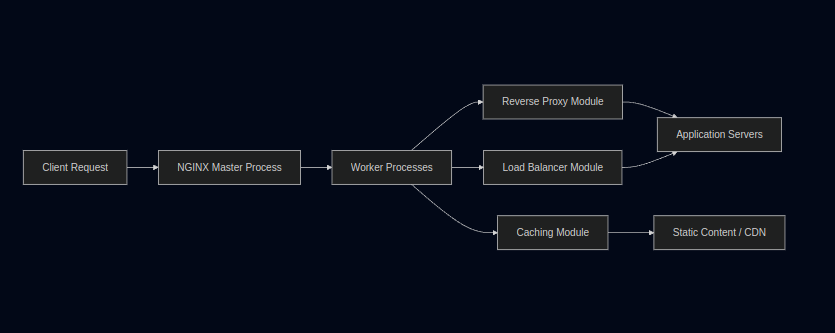

# NGINX: High-Performance Web Server & Reverse Proxy

NGINX is a high-performance, open-source web server, reverse proxy, load balancer, and HTTP cache known for its stability, rich feature set, and low resource consumption. This document provides an overview of its architecture, the problems it solves, and various use cases.

## Overview

NGINX was created to address the challenges of handling a large number of concurrent connections with minimal resource usage. Its event-driven, asynchronous architecture enables it to efficiently serve static content, distribute incoming traffic, and reduce the load on backend systems.

## Architecture

NGINX uses a **master-worker** model that is key to its performance and scalability:

- **Master Process**
  - Reads and parses configuration files.
  - Manages worker processes and handles signals (e.g., for configuration reloads).

- **Worker Processes**
  - Handle all network events (connections, requests, etc.) using a non-blocking, event-driven approach.
  - Efficiently manage thousands of simultaneous connections with minimal overhead.

- **Modules**
  - Extend functionality for load balancing, caching, security, and more.
  - Can be compiled as part of the core or loaded dynamically.

### Architectural Diagram

Below is a high-level diagram illustrating NGINX's architecture and its integration in various scenarios:

**Diagram Explanation:**
- **Client Request:** Incoming requests from users.
- **NGINX Master Process:** Manages configuration and worker processes.
- **Worker Processes:** Handle the actual processing of requests using various modules.
- **Reverse Proxy Module:** Routes requests to backend application servers while hiding their details from the client.
- **Load Balancer Module:** Distributes incoming traffic evenly across multiple backend servers to optimize resource usage.
- **Caching Module:** Caches responses for static content to speed up delivery and reduce backend load.
- **Application Servers & Static Content/CDN:** The backend systems that serve dynamic content and static assets respectively.

## What Problems Does NGINX Solve?

NGINX addresses several common challenges in modern web architecture:

- **Handling High Concurrency:**
  - Traditional process- or thread-based servers (e.g., Apache) can struggle under heavy load. NGINX’s event-driven model allows it to manage thousands of simultaneous connections efficiently.

- **Efficient Static Content Delivery:**
  - Optimized to serve static files (images, stylesheets, scripts) quickly, reducing latency.

- **Load Balancing & Reverse Proxying:**
  - Distributes client requests across multiple servers, enhancing reliability and scalability.
  - Acts as a secure intermediary, masking the details of backend servers.

- **HTTP Caching:**
  - Caches frequently accessed resources, reducing backend workload and improving response times.

- **Extensibility:**
  - A modular architecture that can be extended to support a wide range of functionalities, from security enhancements to performance optimizations.

## Use Cases

1. **Web Server:**
   - Serve static and dynamic content with high efficiency.
  
2. **Reverse Proxy:**
   - Provide an extra layer of security by hiding the backend architecture and handling SSL termination.
  
3. **Load Balancer:**
   - Distribute traffic evenly across several application servers, ensuring no single server is overwhelmed.
  
4. **HTTP Cache:**
   - Cache responses for static content to minimize repeated processing and accelerate content delivery.
  
5. **API Gateway:**
   - Manage API calls, enforce rate limiting, and route traffic to microservices in a distributed architecture.

## Conclusion

NGINX offers a robust solution for modern web infrastructure challenges. Its innovative architecture enables high performance, efficient resource usage, and flexibility across various deployment scenarios—from simple web serving to complex load balancing and caching implementations.

For more details, please refer to the [official NGINX documentation](https://nginx.org/en/docs/).

