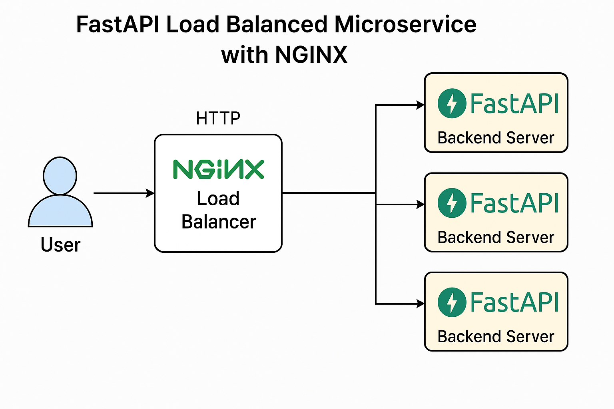
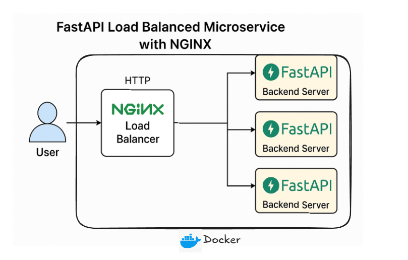

-

# 🔁 FastAPI Load Balanced Microservice with NGINX



This project demonstrates a scalable microservices setup where **FastAPI backend servers** are load balanced using **NGINX**. It utilizes **Docker** and **Docker Compose** to orchestrate multiple backend instances and route traffic efficiently.

---

## 📌 What This Project Does

- Runs **4 FastAPI backend servers** in separate containers.
- Uses **NGINX** as a **reverse proxy and load balancer**.
- Routes requests based on the **client's IP address** using NGINX’s `ip_hash` strategy. (sticky session)
- Displays information such as:
  - Client's IP and port
  - Proxy IP
  - FastAPI backend server IP
  - A static client name (for demo)

---

## 💡 Why This Is Important

- 🔀 **Load balancing** improves scalability and fault tolerance by distributing requests.
- 🧠 **Sticky sessions** (via IP hashing) ensure consistency — users from the same IP go to the same backend.
- 🐳 **Dockerized environment** ensures quick setup, isolation, and portability.
- 🔍 **Request introspection** helps debug headers and routing in microservices or proxy setups.

---
## Architecture Diagram



---

## 🧩 Folder Structure

```
.
├── backend/
│   ├── main.py
│   ├── templates/
│   │   └── index.html
│   ├── requirements.txt
│   └── Dockerfile
├── load_balancer/
│   ├── nginx.conf
│   └── Dockerfile
├── docker-compose.yml
└── README.md
```
---

## 📦 Tech Stack

- **FastAPI** – modern async Python web framework.
- **NGINX** – high-performance reverse proxy/load balancer.
- **Docker + Docker Compose** – containerized orchestration.
- **Jinja2** – templating engine for rendering client/server info on the page.

---

## 🚀 How to Use

1. **Clone the Repository**
   ```bash
   git clone https://github.com/dev-vivekkumarverma/nginx.git
   cd nginx/projects/load_balancer
   ```

2. **Build and Start All Containers**
   ```bash
   docker compose up --build
   ```

3. **Access the App**
   Open your browser and go to:  
   [http://localhost](http://localhost)

   You'll see an HTML page showing:
   - Your IP address
   - Your port
   - Backend server IP
   - Proxy IP
   - Client name

---

## 🛑 How to Stop Everything

To stop and remove all running containers:
```bash
docker compose down
```

---

## 🧪 Optional Commands

- **Check container logs**
  ```bash
  docker logs <container_name>
  ```

- **Access a running backend container**
  ```bash
  docker exec -it <container_name> /bin/bash
  ```

- **Restart just one container**
  ```bash
  docker compose restart <service_name>
  ```

---

## 🙋‍♂️ Author

**Vivek Kumar Verma**  
Made with ❤️ for learning and scaling microservices.

