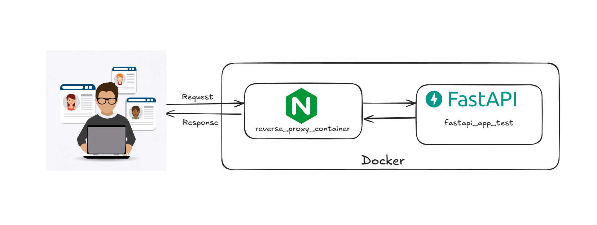

# Reverse Proxy with FastAPI and Nginx

## Project Overview
This project sets up a **FastAPI backend** behind an **Nginx reverse proxy** using Docker and Docker Compose. The Nginx server forwards client requests to the FastAPI application, ensuring better security, load balancing, and scalability.

## Project Structure
```
reverse_proxy/
│── app/
│   ├── template/
│   │   ├── index.css
│   │   ├── index.html
│   ├── Dockerfile
│   ├── main.py
│   ├── requirements.txt
│   ├── route.py
│── app_data/
│── proxy/
│   ├── Dockerfile
│   ├── nginx.conf
│── venv/ (optional, for local development)
│── docker-compose.yaml
│── readme.md
```

### Explanation of Files
- **`app/`**: Contains the FastAPI backend.
  - **`main.py`**: Entry point of the FastAPI application.
  - **`route.py`**: Defines API routes.
  - **`template/`**: Contains HTML and CSS files for frontend rendering.
  - **`requirements.txt`**: Lists dependencies.
  - **`Dockerfile`**: Creates a containerized FastAPI app.

- **`proxy/`**: Contains Nginx configuration.
  - **`nginx.conf`**: Defines how requests are forwarded to FastAPI.
  - **`Dockerfile`**: Builds an Nginx container.

- **`docker-compose.yaml`**: Orchestrates multi-container deployment.
- **`app_data/`**: Stores persistent application data.
- **`readme.md`**: This documentation.

---

## Why Use Nginx as a Reverse Proxy?
Nginx is used as a reverse proxy to:
1. **Improve Security**: Hides backend details, preventing direct access.
2. **Load Balancing**: Distributes traffic across multiple backend instances (future scalability).
3. **SSL Termination**: Handles HTTPS encryption efficiently.
4. **Caching & Compression**: Optimizes responses for faster performance.
5. **Static Content Handling**: Serves frontend assets separately from API requests.

---

## Architecture Diagram


### Request-Response Cycle
1. The **client** makes an HTTP request to `http://localhost`.
2. **Nginx** receives the request and forwards it to the **FastAPI** container.
3. **FastAPI** processes the request, interacts with data, and returns a response.
4. **Nginx** forwards the response back to the client.

---

## Running the Project
### Prerequisites
Ensure you have:
- Docker & Docker Compose installed

### Steps to Run
1. **Clone the repository**:
   ```sh
   git clone https://github.com/dev-vivekkumarverma/nginx.git
   cd nginx/projects/recerse_proxy
   ```
2. **Start the containers**:
   ```sh
   docker-compose up --build
   ```
3. Open `http://localhost` in a browser or use Postman to test API endpoints.

### Stopping the Project
```sh
docker-compose down
```

---

## Future Improvements
- Add a database (PostgreSQL, MySQL, MongoDB).
- Implement HTTPS with SSL certificates.
- Introduce caching with Redis.
- Deploy to a cloud environment (AWS, GCP, Azure).

---

## License
This project is open-source and free to use under the MIT License.

